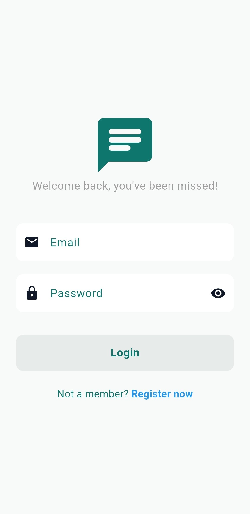
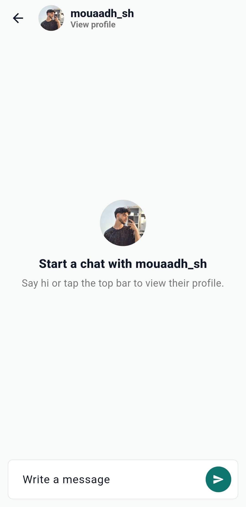
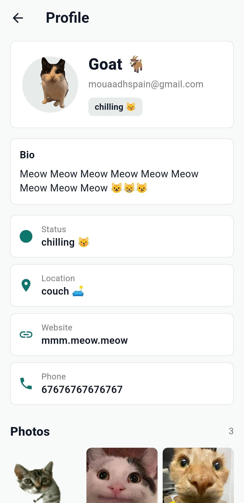
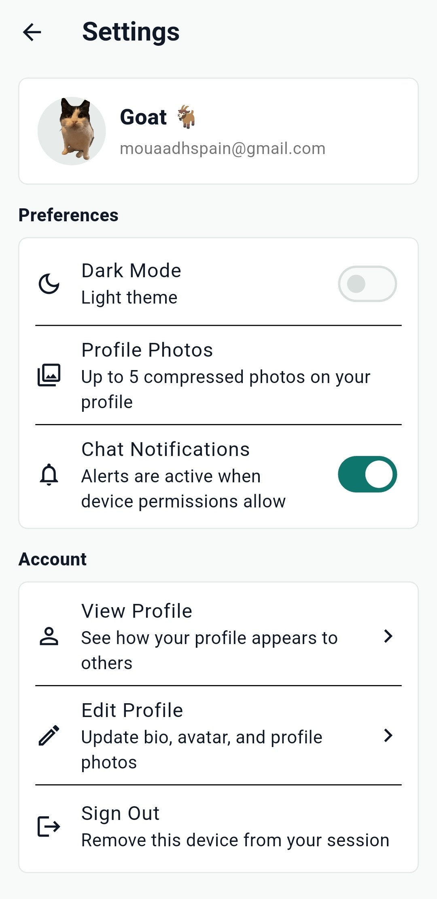

# Flutter Chat App

A real-time chat application built with Flutter and Firebase. The app supports email authentication, searchable users, one-to-one conversations, editable user profiles, profile photos, push notification preferences, onboarding, and light/dark themes.

## Screenshots

| Login | Chat | Profile | Settings |
| --- | --- | --- | --- |
|  |  |  |  |

## Features

<<<<<<< Updated upstream
### Login Screen


### Chat Interface


### Profile Page


### Settings


=======
- Email and password registration/login with Firebase Authentication.
- Automatic user profile creation in Cloud Firestore after sign up.
- Real-time one-to-one chat using Firestore streams.
- Recent chats list based on conversations the current user has joined.
- User search by username to start new conversations.
- Profile pages with username, email, bio, status, location, website, phone, avatar, and photo gallery.
- Profile editing with image uploads through Firebase Storage.
- Profile gallery limited to 5 compressed images.
- Push notification setup using Firebase Cloud Messaging.
- Local Android notification channel using `flutter_local_notifications`.
- Notification settings toggle that saves or removes the device token.
- Notification tap handling that can open the related chat.
- First-launch onboarding saved with Shared Preferences.
- Light and dark mode switching with Provider.
- Reusable UI components for buttons, text fields, drawer navigation, and user tiles.

## Tech Stack

- Flutter and Dart
- Firebase Core
- Firebase Authentication
- Cloud Firestore
- Firebase Storage
- Firebase Cloud Messaging
- Flutter Local Notifications
- Provider
- Image Picker
- Shared Preferences

## Concepts Learned

This project brings together several important Flutter and Firebase concepts:
>>>>>>> Stashed changes

### Flutter App Structure

- Building a Flutter app with `MaterialApp`, `Scaffold`, pages, components, services, models, and themes.
- Splitting code into clear folders such as `pages`, `components`, `services`, `models`, and `themes`.
- Creating reusable widgets for repeated UI patterns.
- Passing data between screens through constructors.
- Using `Navigator` and `MaterialPageRoute` for app navigation.
- Using a global `NavigatorState` key for notification-driven navigation.

### Authentication

- Creating accounts with email and password.
- Signing users in and out with Firebase Authentication.
- Reading the current authenticated user.
- Protecting app flow with an authentication gate.
- Creating Firestore user documents after registration or first login.

### Firestore Database

- Storing user profiles in a `users` collection.
- Creating direct chat documents in a `chats` collection.
- Storing messages inside each chat's `messages` subcollection.
- Using sorted participant IDs to create stable one-to-one chat IDs.
- Querying recent chats with `arrayContains`.
- Reading real-time updates with Firestore snapshots and Dart streams.
- Ordering chat messages by timestamp.

### State Management

- Using Provider and `ChangeNotifier` for theme state.
- Updating UI reactively with `setState`.
- Managing loading, saving, uploading, and empty states.
- Disposing controllers to avoid memory leaks.

### UI and UX

- Building login, register, home, chat, profile, edit profile, settings, and onboarding screens.
- Creating empty states for no chats and no search results.
- Adding search behavior for finding people.
- Building chat bubbles that align differently for sent and received messages.
- Supporting dark and light themes with custom color schemes.
- Using profile avatars, gallery grids, and status labels.

### Images and Storage

- Picking images from the device gallery with `image_picker`.
- Compressing selected profile images before upload.
- Uploading avatar and gallery images to Firebase Storage.
- Saving image download URLs in Firestore.
- Displaying remote profile images with `NetworkImage`.

### Notifications

- Requesting notification permission.
- Registering Firebase Messaging background handlers.
- Saving FCM tokens under each user in Firestore.
- Removing tokens when notifications are disabled or the user signs out.
- Handling token refresh.
- Opening the correct chat when a notification is tapped.

### Local Persistence

- Saving whether the onboarding screen has already been seen.
- Loading that preference before deciding whether to show onboarding or the auth flow.

### Testing and Quality

- Writing widget tests for onboarding and intro gate behavior.
- Using `flutter_lints` for consistent Dart/Flutter code quality.
- Keeping app behavior separated into services so UI files stay easier to read.

## Project Structure

```text
lib/
  components/          Reusable UI widgets
  models/              Data models
  pages/               App screens
  services/
    auth/              Authentication and user profile logic
    chat/              Chat and notification logic
    onboarding/        First-launch onboarding gate
  themes/              Light/dark theme provider and color schemes
  firebase_options.dart
  main.dart

screenshots/           README screenshots
functions/             Firebase Cloud Functions
test/                  Flutter widget tests
```

## Getting Started

### Prerequisites

- Flutter SDK with Dart `^3.11.4`
- A Firebase project
- Android Studio or VS Code
- An Android emulator/device, or another Flutter-supported target

### Firebase Setup

Enable these Firebase services:

- Authentication with email/password provider
- Cloud Firestore
- Firebase Storage
- Cloud Messaging

Then add your Firebase configuration files:

- Android: `android/app/google-services.json`
- Flutter options: `lib/firebase_options.dart`
- iOS/macOS, if used: configure the matching Firebase app files for those platforms

### Run Locally

```bash
flutter pub get
flutter run
```

### Run Tests

```bash
flutter test
```

### Build

```bash
flutter build apk --release
```

For iOS:

```bash
flutter build ios --release
```

## Notes

- Android notification support is implemented with Firebase Messaging and a local notification channel.
- Profile image uploads require Firebase Storage rules that allow authenticated users to upload their own files.
- Firestore rules should protect user and chat data before using this app in production.

## Author

Built as a Flutter and Firebase learning project.
